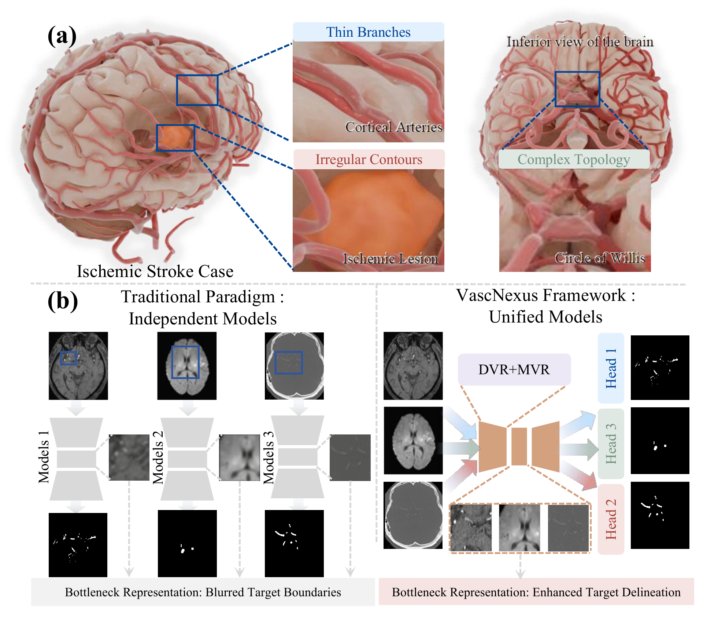

# VascNexus

A research project on task-conditioned 3D medical image segmentation, combining directional spatial modeling, Mamba-based feature refinement, multi-scale attention, and a dynamic segmentation head.

**Figure 1.** Motivation and overview of VascNexus: (a) segmentation challenges, including thin branches, irregular contours, and complex topology; (b) comparison between independent models and the unified VascNexus framework.

## Repository status

This is a **documentation-only project page**, containing the README and its supporting figure. Model implementations, training and inference scripts, pretrained weights, and datasets are not included in this repository.

## Method overview

The implementation combines:

- A 3D encoder-decoder backbone for volumetric segmentation.
- Direction-aware spatial convolutions for local feature extraction.
- Mamba-based feature refinement and attention for contextual modeling.
- A task-conditioned dynamic segmentation head.

The default implementation uses a dynamic-head channel width of **C = 8** and a Mamba state dimension of **d_state = 16**. These are different hyperparameters: C controls the dynamic-head width, while d_state controls the state dimension of the Mamba module.

## Evaluation scope

The project studies segmentation on ISLES24, CAS2023, and TopCoW2024-CT. Dataset-specific image modalities and target labels must be specified when interpreting or reproducing individual experiments; these datasets should not be assumed to share the same segmentation target.

Evaluation metrics include:

| Metric | Meaning | Preferred direction |
| --- | --- | --- |
| DSC / Dice | Dice similarity coefficient | Higher |
| IoU | Intersection over union | Higher |
| PRE | Precision | Higher |
| TPR | True positive rate / recall | Higher |
| FPR | False positive rate | Lower |
| ASD | Average surface distance (mm) | Lower |
| HD95 | 95th-percentile Hausdorff distance (mm) | Lower |

Numerical results are not reproduced on this project page. Comparisons require consistent evaluation splits, aggregation rules, label definitions, and metric implementations.

## Data and privacy

Apart from the illustrative examples embedded in Figure 1, no standalone medical images, segmentation masks, case identifiers, experiment logs, model checkpoints, credentials, or machine-specific paths are distributed here. Access to each dataset is governed by its original provider's terms.

## Usage

This repository currently contains documentation only and cannot be used to train or run the model. It is intended for research communication, not clinical use.
